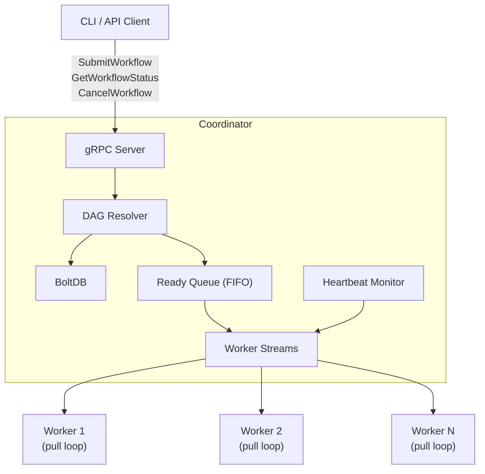

# dag-scheduler

A crash-recoverable distributed DAG task scheduler in Go. Clients submit directed acyclic graph workflows over gRPC. The coordinator resolves dependencies, dispatches tasks to a pull-based worker pool via bidirectional streams, and recovers from both worker and coordinator crashes without losing state.

## Architecture



| Component | Package | Responsibility |
|---|---|---|
| Coordinator | `internal/coordinator` | Task queue, state machine, failure policies, crash recovery |
| DAG Resolver | `internal/coordinator/dag.go` | DFS cycle detection, in-degree computation, downstream adjacency map |
| Heartbeat Monitor | `internal/coordinator/heartbeat.go` | Per-worker last-seen tracking, dead worker detection |
| Watchdog | `internal/coordinator/watchdog.go` | Alerts on workflows running beyond 10 minutes |
| State Store | `internal/store` | BoltDB wrappers, atomic state transitions, serialization |
| Worker | `cmd/worker` | Pull loop, per-task timeout, 64 KB output cap, auto-reconnect |
| Metrics | `internal/metrics` | Prometheus gauges, counters, histograms |

## Execution Model

### Submission

On `SubmitWorkflow`, the coordinator runs DFS cycle detection, computes in-degrees, builds a downstream adjacency map stored per-task in BoltDB, persists the full workflow spec and initial task states, and enqueues tasks with in-degree 0 into the in-memory ready queue.

### Scheduling and dispatch

Workers compete for tasks from a centralized FIFO queue. A worker requests a task by sending `TaskRequest` over its persistent gRPC stream. The coordinator dequeues the next ready task, generates a UUID `execution_id`, marks the task RUNNING and stores the `execution_id` atomically in BoltDB, then sends a `TaskAssignment` back. An empty queue returns `NoTask` with a 1-second backoff hint.

### Dependency unlocking

When a worker reports success, the coordinator executes a single BoltDB transaction that marks the task COMPLETE and decrements the in-degree of each downstream task. Any downstream task whose in-degree reaches 0 transitions PENDING to QUEUED in the same transaction and is appended to the in-memory ready queue. Dependency unlock and task completion are atomic: a coordinator crash cannot leave a task completed without its downstream being unblocked.

### Retries and failure policies

On failure, if `attempt < max_retries` a new `execution_id` is issued and the task is re-queued. Otherwise the task is marked FAILED and the workflow's failure policy is applied.

| Policy | Behavior |
|---|---|
| `FAIL_FAST` | Cancel all QUEUED and PENDING tasks, mark workflow FAILED immediately |
| `SKIP_DOWNSTREAM` | Skip transitive downstream tasks of the failed task; independent branches continue |
| `CONTINUE_INDEPENDENT` | Identical to `SKIP_DOWNSTREAM` |

## Task Lifecycle

| State | Meaning |
|---|---|
| `PENDING` | Waiting for dependencies |
| `QUEUED` | Dependencies satisfied, in ready queue |
| `RUNNING` | Assigned to a worker with an active `execution_id` |
| `COMPLETE` | Worker reported success |
| `FAILED` | Retries exhausted |
| `SKIPPED` | Cancelled or skipped by failure policy |

State transitions:

```
PENDING -> QUEUED    (in-degree reaches 0)
QUEUED  -> RUNNING   (assigned to worker, execution_id issued)
RUNNING -> COMPLETE  (worker reports success with matching execution_id)
RUNNING -> QUEUED    (failure with retries remaining, or dead worker detected)
RUNNING -> FAILED    (failure, retries exhausted)
QUEUED  -> SKIPPED   (FAIL_FAST or workflow cancelled)
PENDING -> SKIPPED   (SKIP_DOWNSTREAM or workflow cancelled)
```

Terminal states (`COMPLETE`, `FAILED`, `SKIPPED`) are final.

## Failure Handling and Recovery

### At-least-once semantics

The system guarantees at-least-once execution. A task may run more than once if the coordinator crashes while it is RUNNING, or if the worker's heartbeat times out and the task is reassigned. Workers must be idempotent.

### Execution ID idempotency

Every assignment carries a UUID `execution_id`. The coordinator tracks the current valid ID per running task. A result with a matching ID is accepted. A mismatched ID is silently discarded, rejecting zombie results from stale workers without ambiguity.

### Worker crash recovery

The heartbeat monitor scans every `scan-interval` (default 5s). Workers exceeding `dead-threshold` (default 15s) are declared dead: all their RUNNING tasks are re-queued with new `execution_id` values. Tasks are reassigned within `scan-interval + dead-threshold`, which is 20s at defaults.

### Coordinator restart recovery

On restart, `LoadStateFromDB` reads all active workflows from BoltDB, rebuilds in-memory caches, and re-populates the ready queue from QUEUED tasks. `PrepareRecovery` then transitions all RUNNING tasks to QUEUED with new `execution_id` values before resuming normal operation. QUEUED tasks survive a crash without re-queuing.

## Persistence Model

BoltDB (bbolt) is the embedded ACID key-value store with no external process dependency.

| Bucket | Key | Value |
|---|---|---|
| `workflows` | workflow_id | Serialized WorkflowSpec |
| `workflow_state` | workflow_id | State, submitted_at_ms, completed_at_ms |
| `task_state` | task_id | State, execution_id, attempt_count, in_degree, downstream_ids, output, error |
| `workers` | worker_id | last_heartbeat, running_task_ids |

Every state-changing operation is a single BoltDB `Update` transaction. `CompleteTask` marks COMPLETE and decrements all downstream in-degrees atomically, which is the critical invariant preventing partial dependency unlocks. The downstream adjacency list is pre-computed at submission and stored per task, enabling O(k) in-degree decrements rather than an O(n) scan.

## Design Decisions

**BoltDB over an external store.** Embedded ACID transactions with no network hop or external process. Single-writer throughput is bounded by fsync rate, which meets the 100 workflows/sec PRD target on NVMe but degrades on macOS.

**Centralized FIFO queue.** Simple and correct, with natural load balancing across all workers. The coordinator is a scheduling bottleneck with no horizontal scale path for the scheduler itself.

**Pull-based bidirectional gRPC streams.** Workers hold persistent streams and initiate pulls via `TaskRequest`, eliminating per-task dial overhead and providing natural backpressure.

**Heartbeat-based dead worker detection.** Workers send explicit heartbeat messages on the stream. `last_seen_ms` is tracked per worker against a configurable `dead-threshold`. Reconnects are handled correctly: a worker that reconnects and resumes heartbeating is treated as alive regardless of the gap.

**At-least-once execution.** Exactly-once would require distributed consensus or two-phase commit across coordinator and worker. The `execution_id` mechanism rejects stale results, but underlying side effects may have already occurred.

## Current Limitations

- **Single coordinator, no HA.** Workflow execution pauses during coordinator downtime with no standby failover.
- **No auth or TLS.** The gRPC server accepts any connection without authentication or encryption.
- **No task sandboxing.** Workers execute shell commands directly with no container isolation or filesystem namespacing.
- **Centralized scheduling bottleneck.** Throughput is bounded by single-writer BoltDB fsync rate.
- **Full BoltDB scan on recovery and status queries.** Degrades as total task count grows.
- **No workflow deduplication.** A duplicate `workflow_id` surfaces as a store-layer error rather than a clean API rejection.
- **Workers must be idempotent.** At-least-once delivery means non-idempotent side effects may execute more than once under crash or reassignment scenarios.

## Quick Start

**Start the coordinator**
```bash
go run ./cmd/coordinator --port 50051 --db /tmp/scheduler.db
```

**Start workers** (separate terminals)
```bash
go run ./cmd/worker --coordinator localhost:50051 --capacity 4
go run ./cmd/worker --coordinator localhost:50051 --capacity 4
```

**Submit a workflow**
```bash
cat <<'EOF' > /tmp/example.json
{
  "workflow_id": "hello-world",
  "failure_policy": "FAIL_FAST",
  "tasks": [
    { "task_id": "fetch",   "command": "echo fetching data" },
    { "task_id": "process", "command": "echo processing",   "dependencies": ["fetch"] },
    { "task_id": "upload",  "command": "echo uploading",    "dependencies": ["process"] }
  ]
}
EOF
go run ./cmd/cli submit /tmp/example.json
go run ./cmd/cli status hello-world --watch
```

**With Docker Compose** (coordinator + 3 workers + Prometheus)
```bash
docker compose up --build
```

## Configuration

### Coordinator flags

| Flag | Default | Description |
|---|---|---|
| `--port` | `50051` | gRPC listen port |
| `--db` | `/tmp/scheduler.db` | BoltDB file path |
| `--metrics-port` | `9090` | Prometheus `/metrics` and pprof port |
| `--scan-interval` | `5s` | Dead worker scan frequency |
| `--dead-threshold` | `15s` | Heartbeat age before a worker is declared dead |

### Worker flags

| Flag | Default | Description |
|---|---|---|
| `--coordinator` | `localhost:50051` | Coordinator address |
| `--capacity` | `4` | Maximum concurrent tasks |

### Workflow JSON schema

```json
{
  "workflow_id": "string (must be unique)",
  "failure_policy": "FAIL_FAST | SKIP_DOWNSTREAM | CONTINUE_INDEPENDENT",
  "tasks": [
    {
      "task_id": "string",
      "command": "shell command",
      "dependencies": ["other_task_id"],
      "env": { "KEY": "VALUE" },
      "timeout_seconds": 60,
      "max_retries": 3
    }
  ]
}
```

## Testing

```bash
# All tests with race detector
go test ./... -race -count=1

# Unit tests only
go test ./internal/... -race -v

# Integration tests
go test ./tests/integration/... -v

# Benchmarks
go test ./internal/coordinator/... -bench=. -benchmem -benchtime=5s
```

### Benchmark results (M4, `-benchtime=3s`)

| Benchmark | ns/op | ops/sec |
|---|---|---|
| `WorkflowSubmission` (10-task DAG) | 33 ms | ~30/sec |
| `TaskAssignmentLatency` | 7.4 ms | ~135/sec |
| `ConcurrentTaskCompletion` (10 goroutines) | 16 ms | ~62/sec |
| `DAGValidation` (100-task fan-out) | 27 µs | ~37K/sec |

Workflow submission throughput is BoltDB write-bound: each 10-task submission serializes ~12 fsync'd transactions. Task assignment at 7.4 ms is purely in-memory.

## Observability

Prometheus metrics at `http://coordinator:9090/metrics`:

| Metric | Type | Description |
|---|---|---|
| `dag_scheduler_queue_depth` | Gauge | Tasks in ready queue |
| `dag_scheduler_active_workers` | Gauge | Workers with recent heartbeats |
| `dag_scheduler_tasks_completed_total` | Counter | Tasks reaching COMPLETE |
| `dag_scheduler_tasks_failed_total` | CounterVec | Tasks reaching FAILED (`workflow_id`, `reason`) |
| `dag_scheduler_tasks_requeued_total` | CounterVec | Requeue events (`reason`: `retry`, `dead_worker`) |
| `dag_scheduler_worker_disconnects_total` | Counter | Worker heartbeat timeouts |
| `dag_scheduler_task_duration_ms` | Histogram | Task E2E time |
| `dag_scheduler_queue_wait_ms` | Histogram | Time from QUEUED to worker receipt |
| `dag_scheduler_boltdb_tx_duration_ms` | Histogram | Write transaction latency |

pprof at `http://coordinator:9090/debug/pprof/`. Live workflow and worker dashboard at `http://coordinator:9090/`.
